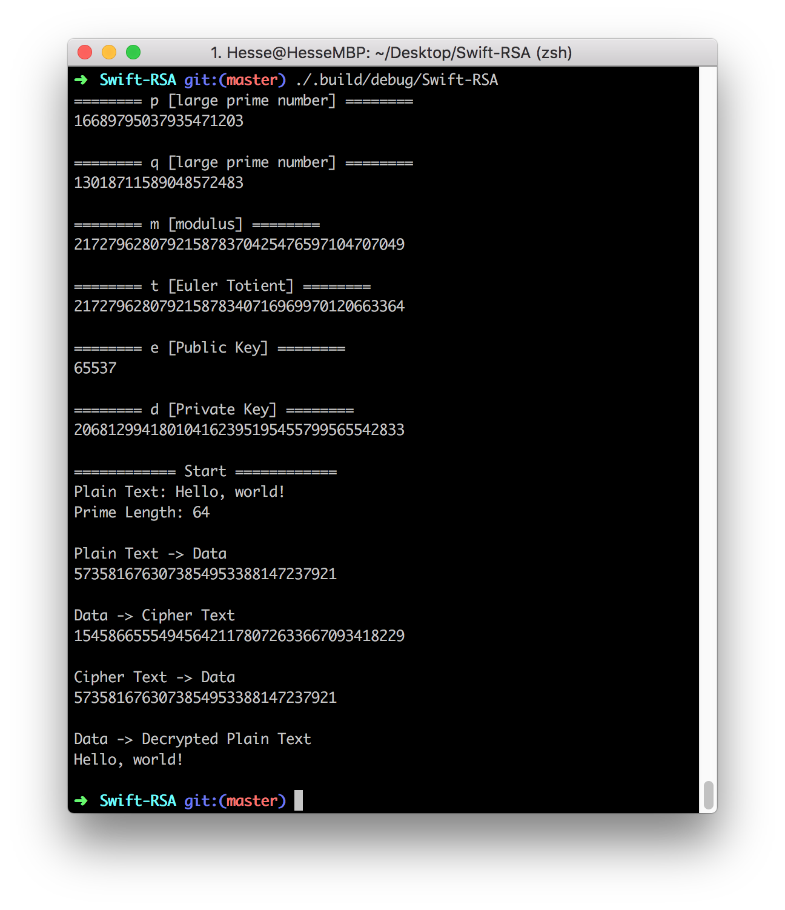

# Swift-RSA

## Introduction

Swift-RSA is a personal experimental project for **Assignment 2 of COMP5525 Information Security: Technologies and Systems** in Hong Kong Polytechnic University.

This project is mainly to implement an RSA encryption and decryption process using Swift. Users can optionally enter a piece of message, which would be encrypted using a newly generated public key followed by being decrypted using a private key. Along the way of implementation, I mainly made use of an open souce project called **[BigInt](https://github.com/attaswift/BigInt)**, which provides a set of handy APIs for manipulating and working with arithmetical numbers in arbitrary width.


## How to Run
1. Clone the project using Git;
```sh
git clone https://github.com/Hesse-Huang/Swift-RSA
```
2. Compile the project. You may ignore the warning popping up in your console;
```sh
cd Swift-RSA
swift build
```
3. Run the program. 
```sh
./.build/debug/Swift-RSA [Optional Params] [Possible Value]
```
Optionally, you may specify the following parameters.

`-m "MYMESSAGE"` The message to be encrypted and decrypted. This parameter is **"Hello, world!"** by default.

`-pl 256` The length of bit to be used when generating larget prime numbers. This parameter is **64** by default.

`-ec` Enable "encode each character" mode. This functionality treats each character as a string and uses each ASCII value in the calculation. This mode is **off** by default.


## Basic Workflow

1. Based on the given prime length, the program firstly generates:
   * `p` - a large prime number
   * `q` - a large prime number (not equal to `p`)
   * `m` - modulus to be made public
   * `t` - Euler Totient
   * `e` - public key, simply a static value 65537
   * `d` - private key, which makes `(e * d) mod(t) = 1`
2. Store public key `(m, e)` and private key` (m, d)`.
3. Encode the given message using UTF8, whose value `n` is used to calculate `(n^e)mod(m)`. It is the encryption process and here we get cipher text `c`.
4. Decrypt the cipher text back to plain text using `(c^d)mod(m)`.


## Screenshot




## Identified Issues

* Couldn't decrypt cipher texts when message is too large and prime length is small.
  * Workaround: try to tune prime length using `-pl`, or specify a small message.
* Long encryption time when prime lenght is too large.
  * Workaround: try to specify a smaller prime length.


## Conclusion

The RSA algorithm works in this project; the encryption and decryption processes work overall. However, after testing I found out that the performance isn't really well. I think that is why RSA generally is not used to directly encrypt and decrypt the message but to transmit symmetric keys.


## Acknowledgement

This project imports an open source project **[BigInt](https://github.com/attaswift/BigInt)** to handle big numbers, and also refers the sample code given about implementing RSA algorithm. Note that there is an issue (the issue #1) when dealing with decryption, so I implement the `-ec` to enable "encode each character" mode.


## Reference

BigInt https://github.com/attaswift/BigInt

RSA algorithm https://en.wikipedia.org/wiki/RSA_(cryptosystem)


